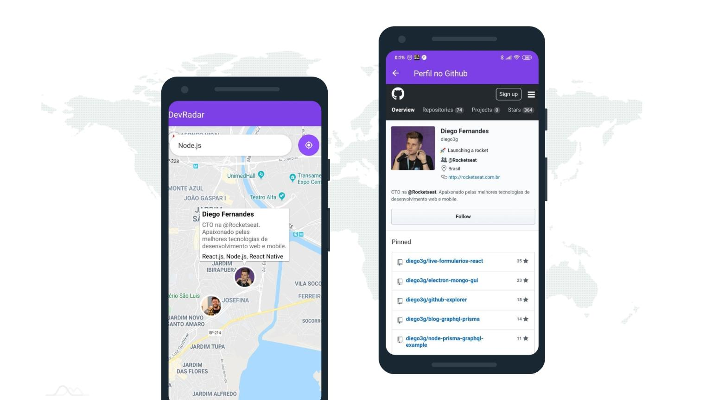

# DevRadar

Find developers based on your favorite technologies!




## 📱 Demo

[https://github.com/jeferson-sb/devradar/releases](https://github.com/jeferson-sb/devradar/releases)

## Technologies used

- [React](https://reactjs.org/) for FrontEnd
- [React Native](https://reactnative.dev/) for Mobile
- [Node.js](https://nodejs.org/) for Backend

## 🚀Quick Start

### Pre-requisites

- Node.js version 8.0 or greater
- Download & Install [MongoDB](https://www.mongodb.com/download-center)
- Download & Install [Mongo Compass](https://www.mongodb.com/products/compass)

### Installation

> **Rename `.env.example` to `.env`**

```bash
cd backend && yarn
```

```bash
cd frontend && yarn
```

### Usage

```bash
# on backend folder
yarn dev
```

```bash
# on frontend folder
yarn start
```

### API Routes

`URL: http://localhost:3333`

| METHOD   | PATH                                            | RETURNS                                 |
| -------- | ----------------------------------------------- | --------------------------------------- |
| `GET`    | `/api/devs`                                     | List of developers                      |
| `POST`   | `/api/devs`                                     | Create a new developer                  |
| `PUT`    | `/api/devs/:id`                                 | Update a developer                      |
| `DELETE` | `/api/devs/:id`                                 | Delete a developer                      |
| `GET`    | `/api/searh?latitude=x&longitude=y&techs=a,b,c` | Filter by latitude, longitude and techs |

_REQUEST BODY_

```json
{ "github_username":"", "techs":"", "latitude":"", "longitude":"" }`
```

### 📝License

This project is licensed under the [MIT License](https://github.com/jeferson/devradar/blob/master/LICENSE.md)
